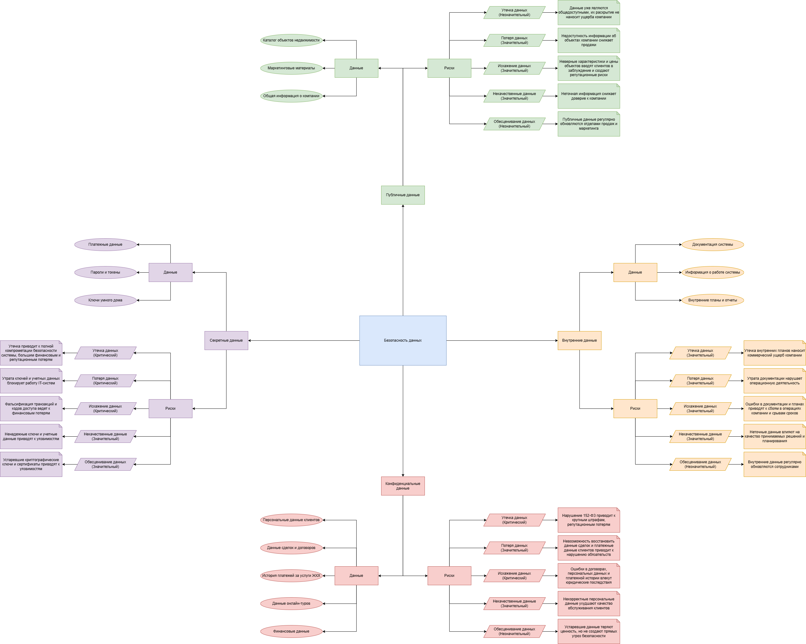
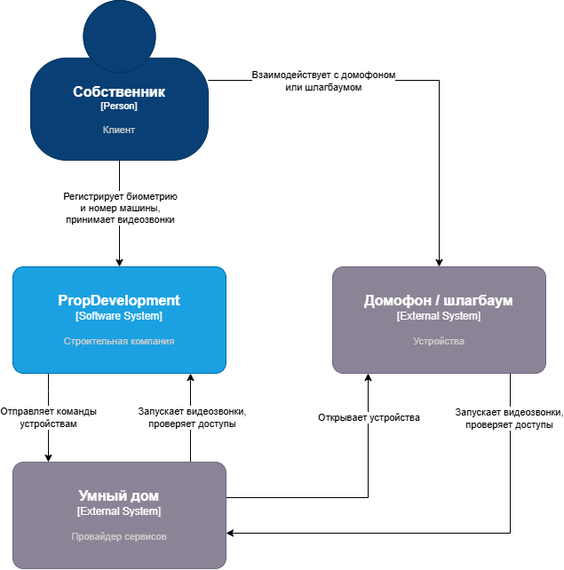
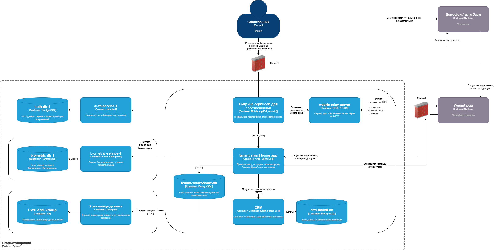

# Проектная работа

## Задание 1

## Задание 2

[Проверочный лист по безопасности данных](Task2/checklist.md)

## Задание 3

**Диаграмма контекста:**

**Диаграмма контейнеров:**

[Требования к безопасности](Task3/requirements.md)

## Задание 4

[Роли](Task4/roles.md)

## Задание 5

[Сетевые политики](Task5/network-policies.yaml)

## Задание 6

[Отчёт по результатам анализа Kubernetes Audit Log](Task6/analysis.md)

## Задание 7

[Аудит и обеспечение соответствия политике безопасности контейнеров](Task7/README_FOR_REVIEWER.md)
